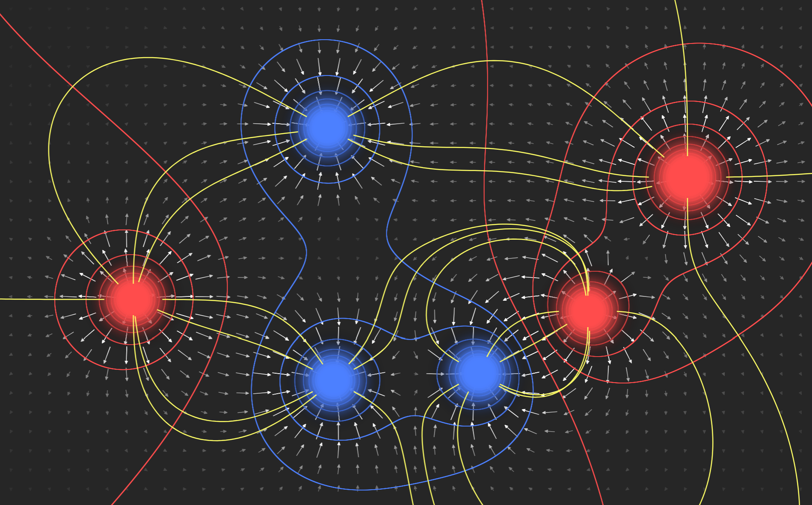

# E-Field Visualizer

A simple static webapp to visualize the electric fields of point charges. 

Charges, equipotential lines, and field vectors are rendered using WebGL in GLSL. User interaction and field line rendering are handled in Javascript. More detailed information on how this webapp works may be found on its help page.
